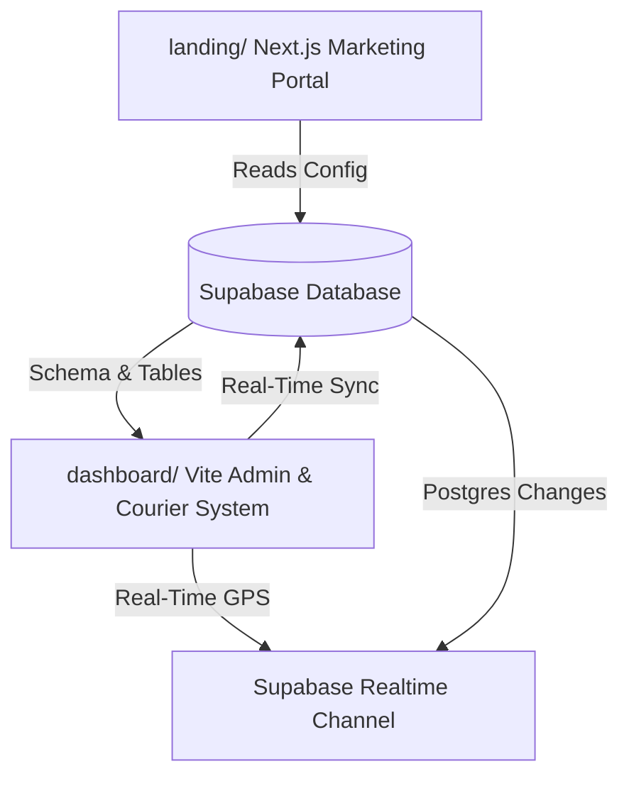

# AttenRider — MKB Rider Monitoring & Management System

Welcome to the **AttenRider** workspace. This repository contains the unified codebase for Mobile Kin Bok (MKB)'s rider monitoring, geofencing, attendance, and payroll automation systems. 

The workspace is organized as a high-fidelity monorepo consisting of a premium Next.js customer/marketing landing portal and a live-synchronized React + Vite operational management dashboard, both integrated with a unified live **Supabase PostgreSQL** backend.

---

## 🏗️ System Architecture



---

## 📂 Repository Structure

The workspace is organized into two primary front-end sub-projects backed by a shared Supabase database schema:

```
MKB-supabase/
├── dashboard/               # Operational Admin/Courier System (React 18 + Vite)
│   ├── src/
│   │   ├── components/      # UI elements (common, reports, rider)
│   │   ├── hooks/           # useRealtimeLocation, useAuth, useFaceRecognition
│   │   ├── lib/             # supabaseClient, reportExport, payrollExport
│   │   ├── pages/           # Admin, HR, Payroll, Rider Dashboard, LiveMonitoring
│   │   ├── services/        # Live Database Services (attendance, geofence, monitoring)
│   │   └── index.css        # Premium custom styles and HSL glassmorphic variables
│   └── package.json
│
├── landing/                 # Public Landing Page & Docs (Next.js 14 App Router)
│   ├── app/                 # Next.js Pages & Routing
│   ├── components/          # Marketing components
│   ├── public/              # Static assets & brand media
│   └── package.json
│
├── attenrider_schema.sql    # Core database tables, triggers, and PostGIS geofences
├── supabase_setup_instructions.md # Walkthrough for bootstrapping the Supabase backend
├── package.json             # Root monorepo package runner
└── README.md                # Workspace documentation
```

---

## 🌟 Core Products

### 1. The Landing Portal (`landing/`)
A Next.js 14 app implementing modern marketing pages, product deep-dives, and detailed integration documentation. It is styled with custom Tailwind designs and responsive typography to introduce AttenRider to stakeholders and couriers.

### 2. The Operational Dashboard (`dashboard/`)
A React 18 + Vite application featuring high-fidelity dark-mode, glassmorphic card grids, and micro-interactions. The dashboard scopes features dynamically based on user roles:
* **Admin Portal**: Accesses the global `Live Monitoring` map, manages zones, administers `Users`, reviews logs, and compiles downloads.
* **HR Portal**: Monitors rider attendance, tracks punctuality KPIs, and generates geofence violations lists.
* **Payroll Portal**: Automatically calculates payouts based on hours present, manages cutoffs, and prints payroll summaries.
* **Courier Portal**: Built touch-first for mobile devices. Couriers can record check-ins with camera biometric scanning and view their assigned zone limits in real-time.

---

## 🛠️ Live Supabase Database Schema

The system utilizes custom SQL tables, spatial constraints, and automated database triggers (`attenrider_schema.sql`):
* **`users`**: System roles (`admin`, `hr`, `payroll`, `rider`) linked to Supabase Auth.
* **`riders`**: Courier directories containing GPS coordinates, speed, and shift details.
* **`zones`**: Geofenced regions containing map coordinates (`lat`/`lng`), boundary radii, and active statuses.
* **`attendance_logs`**: Chronological clock-ins and clock-outs, automatically calculating elapsed hours.
* **`violations`**: Chronological log of idle excesses and boundary exit violations.
* **`rider_locations`**: Historical GPS ping logs used for drawing Strava-style courier maps and calculating cumulative route distances.

---

## 🚀 Setup & Installation

### Prerequisites
* **Node.js** (v18.x or higher)
* **npm** or **pnpm** (available on path)
* **Supabase Account** (active project URL and Anon key)

### Quick Start Installation

1. **Clone the repository**:
   ```bash
   git clone <repository-url>
   cd MKB-supabase
   ```

2. **Bootstrap the entire monorepo**:
   Run the root installer to automatically install dependencies for both the `dashboard` and `landing` portals in one command:
   ```bash
   npm install
   ```

3. **Configure Environment Variables**:
   * Create a `.env` file in the `dashboard/` directory:
     ```env
     VITE_SUPABASE_URL=https://your-project-ref.supabase.co
     VITE_SUPABASE_ANON_KEY=your-public-anon-key
     ```
   * Create a `.env.local` file in the `landing/` directory:
     ```env
     NEXT_PUBLIC_SUPABASE_URL=https://your-project-ref.supabase.co
     NEXT_PUBLIC_SUPABASE_ANON_KEY=your-public-anon-key
     ```

4. **Launch Development Servers**:
   Run the root developer runner to spin up both applications concurrently:
   ```bash
   npm run dev
   ```
   * **React Dashboard**: Accessible at `http://localhost:5173`
   * **Next.js Landing Portal**: Accessible at `http://localhost:3000`

---

## 📊 Visualizations & Premium Analytics

The Reports page integrates three responsive, dynamic, real-time data charts:
1. **Attendance Rate Chart (Line)**: Displays smooth, monotonic attendance trends across 30 days.
2. **Violations by Zone Chart (Bar)**: Highlights active boundary exit violations in real-time.
3. **Rider Status Mix (Donut)**: Real-time pie split of rider states (Active, Idle, Violation, Offline) using unique concurrent channel subscriptions to prevent thread conflicts. Includes a gorgeous light-gray placeholder donut when the database is first initialized.

---

## 🎯 Verification & Build Health

Both applications build cleanly with **zero TypeScript errors and warnings**:
```bash
# Compile Vite Dashboard
cd dashboard && npm run build

# Compile Next.js Landing
cd landing && npm run build
```

---

## 🤝 Support & Contribution
For inquiries or core schema updates, please review [supabase_setup_instructions.md](file:///c:/Users/NaphierNODE/Documents/NaphierPROJECTS/MKB-supabase/supabase_setup_instructions.md) or submit a Pull Request.

**MKB Corporation · Safe Driving, Punctual Deliveries** 🛵
