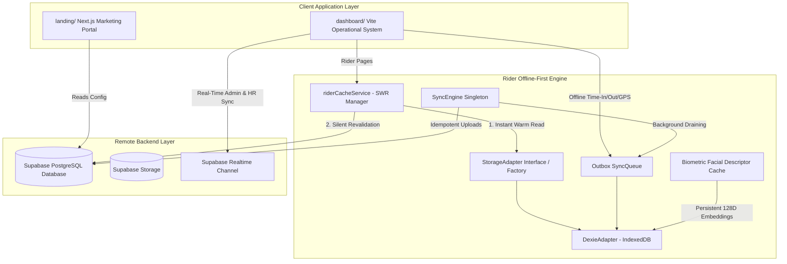

# AttenRider — MKB Rider Monitoring, Attendance & Payroll System

Welcome to the **AttenRider** workspace. This repository contains the unified codebase for Mobile Kin Bok (MKB)'s rider monitoring, geofencing, face biometric verification, offline-first attendance queueing, and payroll automation systems. 

The workspace is organized as a high-fidelity monorepo consisting of a premium Next.js customer/marketing portal and a real-time React + Vite operational management dashboard, both integrated with a unified **Supabase PostgreSQL** backend and an **Offline-First IndexedDB Data Layer**.

---

## 🏗️ System Architecture



---

## 📂 Repository Structure

The workspace is organized into two primary front-end sub-projects backed by a shared Supabase database schema and offline storage adapters:

```
MKB-supabase/
├── dashboard/               # Operational Admin, HR, Payroll & Courier System (React 18 + Vite)
│   ├── src/
│   │   ├── components/      # Modular UI (attendance, common, maps, payroll, reports, rider)
│   │   ├── context/         # Global Contexts (AuthContext, RiderZoneContext)
│   │   ├── hooks/           # Custom Hooks (useAuth, useFaceRecognition, useGeolocation, useNetworkStatus)
│   │   ├── lib/             # Core Utilities & Infrastructure
│   │   │   ├── descriptorCache.ts  # Persistent 128D Face Vector Cache
│   │   │   ├── faceAi.ts           # MediaPipe / FaceAI Detection & Liveness Engine
│   │   │   ├── geofenceUtils.ts    # Polygon & Haversine Distance Calculation
│   │   │   ├── storage/            # Offline Storage Layer
│   │   │   │   ├── StorageAdapter.ts   # Abstract Key-Value & Outbox Interface
│   │   │   │   └── DexieAdapter.ts     # IndexedDB Concrete Adapter
│   │   │   └── sync/               # Background Synchronization Layer
│   │   │       └── SyncEngine.ts       # Idempotent Background Outbox Processor
│   │   ├── pages/           # Application Portals
│   │   │   ├── AdminDashboard.tsx  # Global Fleet & System Analytics
│   │   │   ├── HRDashboard.tsx     # Attendance & Punctuality Operations
│   │   │   ├── LiveMonitoring.tsx  # Fleet GPS Map & Violation Tracking
│   │   │   ├── PayrollDashboard.tsx # Salary Calculation & Paystub Export
│   │   │   ├── RiderDashboard.tsx  # Courier Touch-First Portal (Offline-First)
│   │   │   ├── RiderAttendance.tsx # Rider Monthly Log History
│   │   │   ├── RiderMonitoring.tsx # Rider Route Trail & Geofence Map
│   │   │   └── RiderProfile.tsx    # Courier Credentials & Shift Info
│   │   ├── services/        # Data Services & SWR Layer
│   │   │   ├── attendanceService.ts # Supabase Attendance Database Operations
│   │   │   ├── riderCacheService.ts  # Stale-While-Revalidate (SWR) Cache Manager
│   │   │   ├── monitoringService.ts  # GPS Ping Logging & Fleet Tracking
│   │   │   └── routeService.ts       # Courier Historical Trail Generation
│   │   └── index.css        # Premium Design System & HSL Glassmorphic Styling
│   └── package.json
│
├── landing/                 # Public Landing Portal & Docs (Next.js 14 App Router)
│   ├── app/                 # Next.js Pages & Layouts
│   ├── components/          # Marketing components
│   └── package.json
│
├── attenrider_schema.sql    # Core database tables, triggers, and PostGIS geofences
├── supabase_setup_instructions.md # Step-by-step Supabase bootstrap guide
├── package.json             # Root monorepo workspace scripts
└── README.md                # System documentation
```

---

## 🌟 System Portals & Features

### 1. Courier / Rider Portal (`Touch-First & Offline-First`)
Built specifically for mobile webviews and mobile devices:
* **Instant SWR Startup**: Dashboard, attendance history, and profile render in **< 50ms** from local IndexedDB cache.
* **Offline Attendance Queueing**: Time-In and Time-Out actions enqueued to `SyncQueue` when cellular network drops.
* **Offline Face Recognition**: Face biometrics verify identity 100% offline using locally persistent 128-dimensional Float32Array embeddings.
* **Geofence Validation**: Real-time client-side Haversine distance and polygon boundary validation.
* **Automatic Background Sync**: `SyncEngine` auto-drains outbox queues upon network restoration with exponential backoff and spatial-temporal GPS log thinning.

### 2. Admin Operational Portal
* **Live Fleet Monitoring**: Real-time interactive map rendering active rider pins, speeds, and status markers.
* **Geofence Management**: Polygon and circular zone creation with status toggles.
* **System Administration**: User directory management, role assignments (`admin`, `hr`, `payroll`, `rider`), and audit logging.

### 3. HR Portal
* **Attendance Oversight**: Real-time clock-in/out tracking with automated late/absent classifications.
* **Biometric Enrollment**: Managing rider face reference descriptors.
* **Violation Logs**: Tracking idle excesses and geofence exit violations.

### 4. Payroll Portal
* **Automated Pay Computations**: Salary calculations derived from validated attendance hours.
* **Export Engine**: One-click generation of PDF paystubs and Excel summaries (`jspdf`, `xlsx`).
* **Payroll Cutoff Management**: Draft, pending, approved, and paid workflow locks.

---

## ⚡ Offline-First Technical Architecture (Phases 1–4)

```
[ Rider UI Action ] ──► [ StorageAdapter Interface ]
                                │
               ┌────────────────┴────────────────┐
               ▼                                 ▼
      [ Key-Value SWR Cache ]          [ Outbox SyncQueue ]
     (IndexedDB / Dexie.js)           (Pending FIFO Outbox)
               │                                 │
               ▼                                 ▼
       [ Instant Render ]               [ SyncEngine Processor ]
           (< 50ms)                              │
                                                 ▼
                                     [ Supabase PostgreSQL ]
                                     (Idempotent Upsert / 23505)
```

1. **StorageAdapter Abstraction**: A decoupled storage contract preparing the system for future native mobile integration (`Capacitor + SQLite`).
2. **SWR Cache Manager (`riderCacheService.ts`)**: Serves local cached data immediately while revalidating against Supabase silently in the background.
3. **Idempotent Queueing**: Attendance events assign deterministic client-side UUID v4 primary keys at click time, eliminating duplicate records (`ON CONFLICT (id) DO NOTHING`).
4. **GPS Thinning**: Outbox location pings recorded within 15 seconds and 10 meters are thinned before upload, saving ~60% cellular bandwidth on reconnection.

---

## 🛠️ Live Supabase Database Schema

The database utilizes custom SQL tables, spatial triggers, and computed columns (`attenrider_schema.sql`):
* **`users`**: System credentials and assigned role (`admin`, `hr`, `payroll`, `rider`).
* **`riders`**: Courier directory containing assigned zone ID, current GPS position, status, and 128D face descriptor array.
* **`zones`**: Delivery boundaries containing coordinates, polygon arrays, and radii.
* **`attendance_logs`**: Chronological Time-In and Time-Out timestamps with PostgreSQL generated `hours` column.
* **`violations`**: Logged geofence exits and idle time breaches.
* **`rider_locations`**: Historical GPS pings for breadcrumb map route trails.

---

## 🚀 Setup & Installation

### Prerequisites
* **Node.js** (v18.x or higher)
* **npm** (v9.x or higher)
* **Supabase Project** (active project URL and Anon key)

### Quick Start Installation

1. **Clone the repository**:
   ```bash
   git clone <repository-url>
   cd MKB-supabase
   ```

2. **Bootstrap dependencies**:
   ```bash
   npm install
   ```

3. **Configure Environment Variables**:
   * Create `dashboard/.env`:
     ```env
     VITE_SUPABASE_URL=https://your-project-ref.supabase.co
     VITE_SUPABASE_ANON_KEY=your-public-anon-key
     ```
   * Create `landing/.env.local`:
     ```env
     NEXT_PUBLIC_SUPABASE_URL=https://your-project-ref.supabase.co
     NEXT_PUBLIC_SUPABASE_ANON_KEY=your-public-anon-key
     ```

4. **Launch Development Servers**:
   ```bash
   npm run dev
   ```
   * **Dashboard**: `http://localhost:5173`
   * **Landing**: `http://localhost:3000`

---

## 🎯 Build & Quality Verification

Both applications compile cleanly with **0 errors and 0 lint warnings**:

```bash
# Verify Dashboard ESLint & Build
cd dashboard
npx eslint src
npx vite build
```

---

## 📄 Documentation & References

* [Technical Architecture Specification](file:///C:/Users/NaphierNODE/.gemini/antigravity-ide/brain/f0a7e1c2-089f-4b10-b0fe-6c8445cb1ffa/offline_first_rider_architecture_spec.md)
* [Supabase Bootstrap Instructions](file:///c:/Users/NaphierNODE/Documents/NaphierPROJECTS/MKB-supabase/supabase_setup_instructions.md)

**MKB Corporation · Safe Driving, Punctual Deliveries** 🛵
